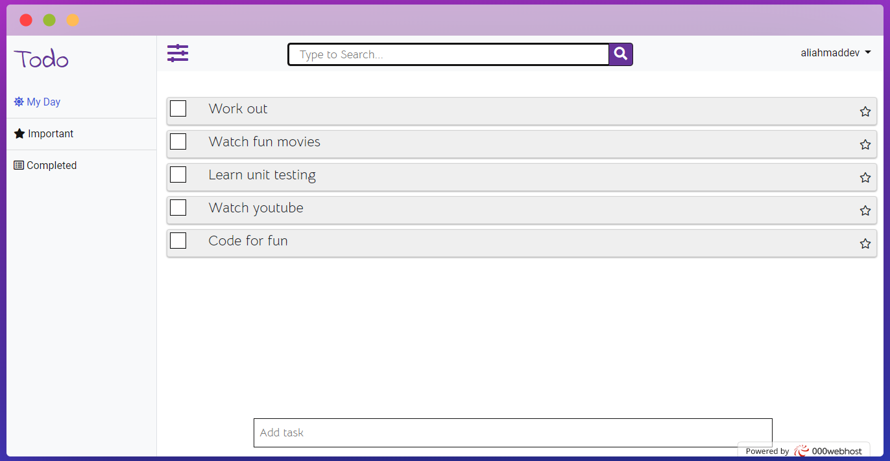

#  Todo-App

##  Usage (Very Easy)

- Sign in by using your username and password and access full features
- **My Day** section contains your daily todo's
- See your important tasks under **Important** section
- See the completed todo's under the **completed** section

##  Want to test in local server

✔ Clone the repo\
✔ Move the repo into your server's root folder\
✔ Import the **todo.sql** into mysql database\
✔ Start your server and type `localhost/reponame/public` to open home page\
✔ Write some code and open pull requeest

## Wannna connect. Follow me on [Twitter](http://twitter.com/aliahmadcse) 
